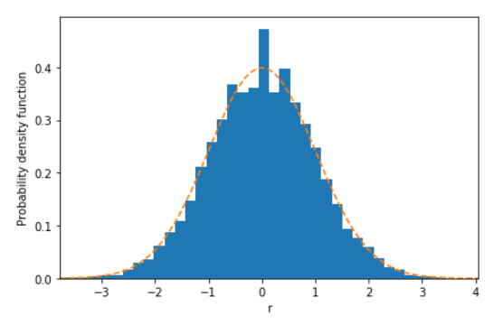
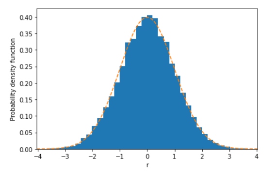
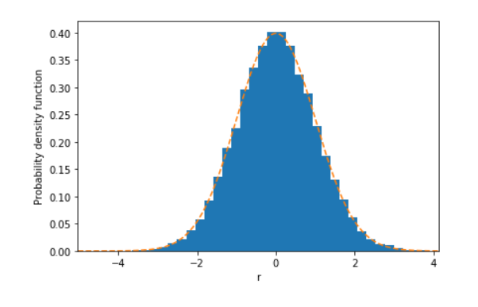

# Weekly progress journal

## Instructions

In this journal you will document your progress of the project, making use of the weekly milestones.

Every week you should 

1. write down **on the day of the lecture** a short plan (bullet list is sufficient) of how you want to 
   reach the weekly milestones. Think about how to distribute work in the group, 
   what pieces of code functionality need to be implemented.
2. write about your progress **until Monday, 23:59** before the next lecture with respect to the milestones.
   Substantiate your progress with links to code, pictures or test results. Reflect on the
   relation to your original plan.

We will give feedback on your progress on Tuesday before the following lecture. Consult the 
[grading scheme](https://computationalphysics.quantumtinkerer.tudelft.nl/proj1-moldyn-grading/) 
for details how the journal enters your grade.

Note that the file format of the journal is *markdown*. This is a flexible and easy method of 
converting text to HTML. 
Documentation of the syntax of markdown can be found 
[here](https://docs.gitlab.com/ee/user/markdown.html#gfm-extends-standard-markdown). 
You will find how to include [links](https://docs.gitlab.com/ee/user/markdown.html#links) and 
[images](https://docs.gitlab.com/ee/user/markdown.html#images) particularly.

## Week 1

### Bullet list:

1. Research on the process of VMC and the different algorithms (@mserraperalta, @abermejillo, @dbedialaunetar)
6. Write a sketch for the structure of the library (@mserraperalta)
2. Search for a trial wavefunction and compute the analytic $`E_{local}`$ for the harmonic oscillator (@mserraperalta)
3. Implement the Metropolis algorithm (@abermejillo)
4. Implement the Monte Carlo integration algorithm (@dbedialaunetar)
5. Validate the results for E(parameter) for the harmonic oscillator (@mserraperalta, @abermejillo, @dbedialaunetar)

### Progress:

First, we will briefly comment how the tasks from the bulletlist have been performed and by whom.

1. @dbedialaunetar, @abermejillo and @mserraperalta all did some research and discussed how to best implement the different algorithms. 
2. @mserraperalta prepared a [skeleton](bc84c58e966ce216faaf9866dcb1db6ba76a8eba) for the project.
2. @mserraperalta implemented [symbolic calculation](cdf8cd38988a0217d29d56d02a2e6b06d675db6b) of the local E and the trial wavefunction. First he included the case of the Harmonic Oscillator.
3. @abermejillo implemented the [Metropolis algorithm](78626b745c015c17be106f9ed53da549e6d832f7) and also a function [find optimal trial move](b2b089f2ad6283aa2bcb87b90826f0e14d3e6175) that finds a trial move with average acceptance ratio 0.5 $`\pm`$ tol.
4. @dbedialaunetar implemented the [Monte Carlo integration algorithm](46fac493d8c56504cbc0633f53fa38f2289668e0).
5. @abermejillo and @mserraperalta checked that the walkers [sampled a gaussian](1794ed020ce402570b8f041dc9f4cbb914da3cf0) correctly and @mserraperalta that the energy of the [Harmonic Oscillator](f76f056e789b16f8b5173b34f587eee51aeee0ca) is computed correctly.

**Results and comments**

After implementing the Metropolis algorithm we have to check that functions are properly sampled. We perform this analysis for a very simple function, a gaussian. The parameter that needs to be fixed is the trial move. As we made a choice to perform trial moves according to a Gaussian distribution, the parameter of the trial move is the standard deviation of the Gaussian ($`\sigma_{tm}`$) and the distribution is clearly balanced. 

$`\sigma_{tm}=10`$             |  $`\sigma_{tm}=1`$ 
:-------------------------:|:-------------------------:
 |  

$`\sigma_{tm}=0.01`$             |  $`\sigma_{tm,opt}=1.987`$ 
:-------------------------:|:-------------------------:
 |  

In these figures, we can see the histogram of 50000 steps for three different values of the trial move. According to the choice of units, a distance of the order of unity is the most appropriate from the three histograms, and this is confirmed by the sampling. When the trial move is 10, the sampling is a bit worse than when it is 1. When the sampling is 0.01, it is completely inservible. Finally, we compute an optimal trial move $`\sigma_{tm}=1.987`$, for which the sampling is adapted very nicely to the gaussian. 

After implementing the Montecarlo algorithm and the symbolic treatment, we test out our code for the quantum harmonic oscillator. We use the following hamiltonian

$`H \Psi = -\frac{1}{2}\frac{d^2 \Psi }{d x^2}+\frac{1}{2}x^2\Psi `$

and the following trial wave function

$`\Psi (x) = (\frac{2\alpha}{\pi})^{1/4} e^{-\alpha x^2},`$

where position is in units of $`\sqrt{\frac{\hbar}{m\omega}}`$ and energy is in units of $`\hbar \omega `$. Therefore, the exact eigenvalues of this hamiltonian are

$`E_n = n+\frac{1}{2}`$.

We now show the expectation values of the energy obtained for different values of $`\alpha`$.

For each point, we averaged $`E_{local}(x,\alpha) = H\Psi(x,\alpha) / \Psi(x,\alpha)`$ over a distribution of points $`\{x_i\}`$ that follows the probability density function of the trial wave function in order to get $`E(\alpha)`$ for a single random walker. The amount of points $`\{x_i\}`$ taken is 25000. We then averaged $`E(\alpha)`$ over 250 walkers, where each walker has a different starting position. The errorbars correspond to the standard deviation of $`E(\alpha)`$ over the 250 walkers. We can see how for $`\alpha = 1/2`$, which corresponds to the exact ground state $`n=0`$, we obtain a minimum energy of $`1/2`$ and a zero standard deviation. The latter is to be expected since if $`E_{local}(x,\alpha=1/2)=E_0=1/2`$,  $`\forall x`$.

Noteworthy, the trial wavefunction does not need to be normalized because the Metropolis algorithm works with the ratio $`\Psi(x_{new},\alpha) / \Psi(x_{old},\alpha)`$ and also $`E_{local}(x,\alpha) = H\Psi(x,\alpha) / \Psi(x,\alpha)`$, therefore the normalization constants cancel. 

Finally, we plot the optimal trial move parameter ($`\sigma_{tm}`$) for each value of $`\alpha`$

It makes sense that the trial move parameter decreases as the width of the probability density function decreases, that is, as $`\alpha`$ increases.

(due 18 April 2022, 23:59)

## Week 2

### Bullet list:

1. Try to implement computational parallelization for different walkers (@mserraperalta).
2. Implement the steepest descent method (@dbedialaunetar).
3. Implement the Helium hamiltonian and try to obtain a simplified symbolic representation of E_local (@abermejillo).
4. Start obtaining numerical results for harmonic oscillator and hydrogen and helium atoms with steepest descent. (@abermejillo, @mserraperalta, @dbedialaunetar)
5. Discuss extra things to implement (first excited state energy, different minimization algorithms...) (@abermejillo, @mserraperalta, @dbedialaunetar)

(due 25 April 2022, 23:59)

## Week 3
(due 2 May 2022, 23:59)

