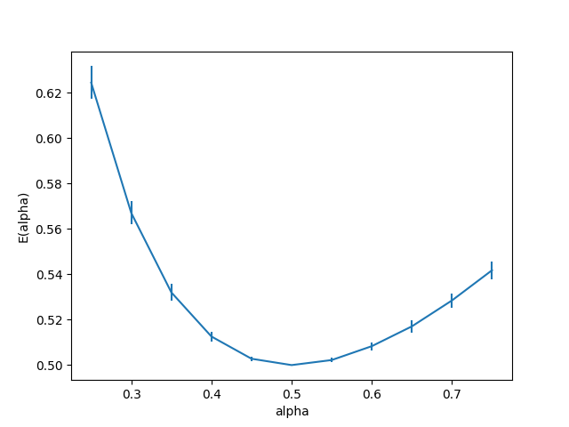
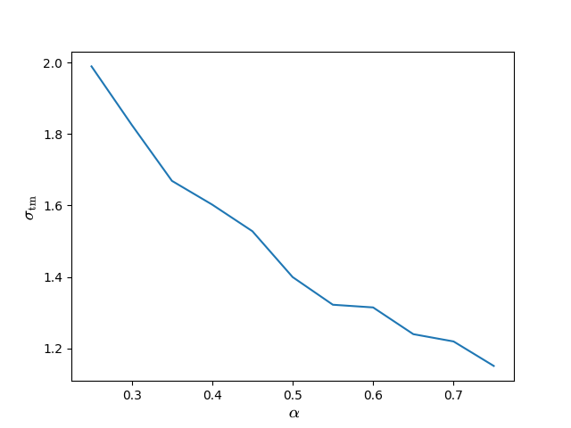
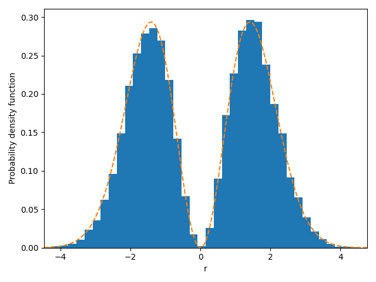
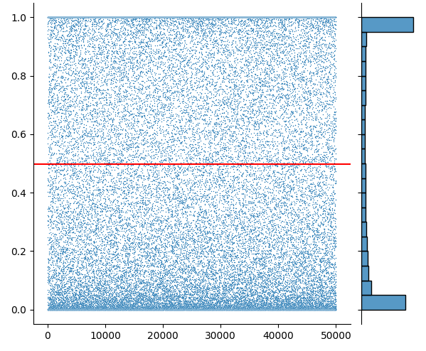
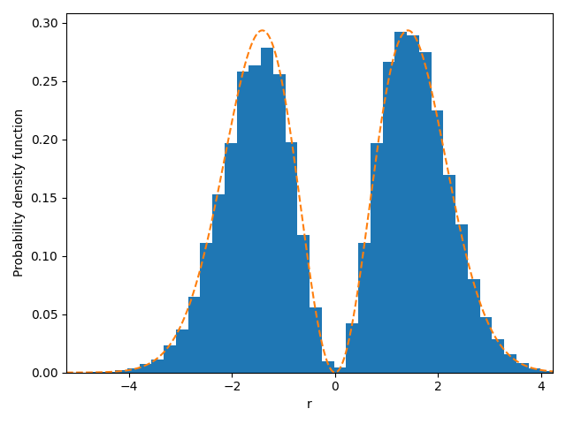
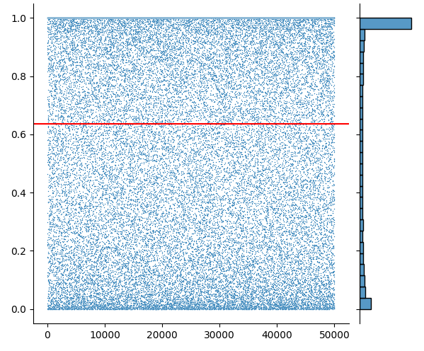
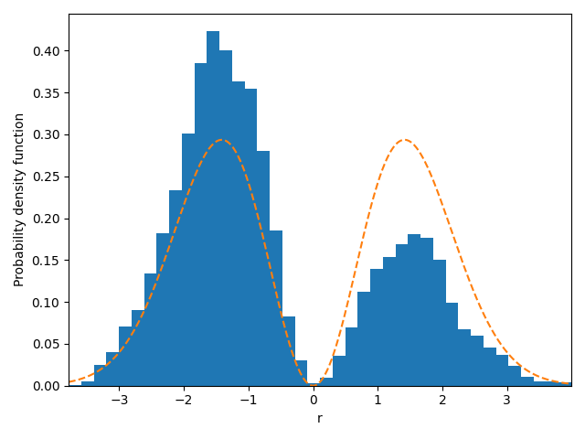
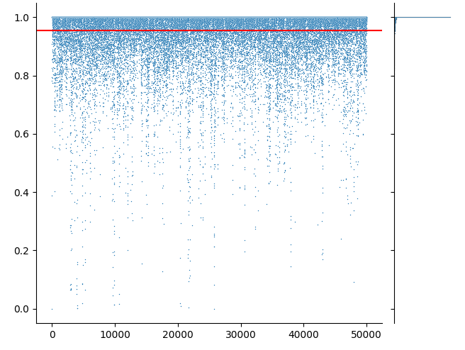

# Weekly progress journal

## Instructions

In this journal you will document your progress of the project, making use of the weekly milestones.

Every week you should 

1. write down **on the day of the lecture** a short plan (bullet list is sufficient) of how you want to 
   reach the weekly milestones. Think about how to distribute work in the group, 
   what pieces of code functionality need to be implemented.
2. write about your progress **until Monday, 23:59** before the next lecture with respect to the milestones.
   Substantiate your progress with links to code, pictures or test results. Reflect on the
   relation to your original plan.

We will give feedback on your progress on Tuesday before the following lecture. Consult the 
[grading scheme](https://computationalphysics.quantumtinkerer.tudelft.nl/proj1-moldyn-grading/) 
for details how the journal enters your grade.

Note that the file format of the journal is *markdown*. This is a flexible and easy method of 
converting text to HTML. 
Documentation of the syntax of markdown can be found 
[here](https://docs.gitlab.com/ee/user/markdown.html#gfm-extends-standard-markdown). 
You will find how to include [links](https://docs.gitlab.com/ee/user/markdown.html#links) and 
[images](https://docs.gitlab.com/ee/user/markdown.html#images) particularly.

## Week 1

### Bullet list:

1. Research on the process of VMC and the different algorithms (@mserraperalta, @abermejillo, @dbedialaunetar)
6. Write a sketch for the structure of the library (@mserraperalta)
2. Search for a trial wavefunction and compute the analytic $`E_{local}`$ for the harmonic oscillator (@mserraperalta)
3. Implement the Metropolis algorithm (@abermejillo)
4. Implement the Monte Carlo integration algorithm (@dbedialaunetar)
5. Validate the results for E(parameter) for the harmonic oscillator (@mserraperalta, @abermejillo, @dbedialaunetar)

### Progress:

First, we will briefly comment how the tasks from the bulletlist have been performed and by whom.

1. @dbedialaunetar, @abermejillo and @mserraperalta all did some research and discussed how to best implement the different algorithms. 
2. @mserraperalta prepared a [skeleton](bc84c58e966ce216faaf9866dcb1db6ba76a8eba) for the project.
2. @mserraperalta implemented [symbolic calculation](cdf8cd38988a0217d29d56d02a2e6b06d675db6b) of the local E and the trial wavefunction. First he included the case of the Harmonic Oscillator.
3. @abermejillo implemented the [Metropolis algorithm](78626b745c015c17be106f9ed53da549e6d832f7) and also a function [find optimal trial move](b2b089f2ad6283aa2bcb87b90826f0e14d3e6175) that finds a trial move with average acceptance ratio 0.5 $`\pm`$ tol.
4. @dbedialaunetar implemented the [Monte Carlo integration algorithm](46fac493d8c56504cbc0633f53fa38f2289668e0).
5. @abermejillo and @mserraperalta checked that the walkers [sampled a gaussian](1794ed020ce402570b8f041dc9f4cbb914da3cf0) correctly and @mserraperalta that the energy of the [Harmonic Oscillator](f76f056e789b16f8b5173b34f587eee51aeee0ca) is computed correctly.

**Results and comments**

After implementing the Metropolis algorithm we have to check that functions are properly sampled. We perform this analysis for a very simple function, a gaussian. The parameter that needs to be fixed is the trial move. As we made a choice to perform trial moves according to a Gaussian distribution, the parameter of the trial move is the standard deviation of the Gaussian ($`\sigma_{tm}`$) and the distribution is clearly balanced. 

$`\sigma_{tm}=10`$             |  $`\sigma_{tm}=1`$ 
:-------------------------:|:-------------------------:
 |  

$`\sigma_{tm}=0.01`$             |  $`\sigma_{tm,opt}=1.987`$ 
:-------------------------:|:-------------------------:
 |  

In these figures, we can see the histogram of 50000 steps for three different values of the trial move. According to the choice of units, a distance of the order of unity is the most appropriate from the three histograms, and this is confirmed by the sampling. When the trial move is 10, the sampling is a bit worse than when it is 1. When the sampling is 0.01, it is completely inservible. Finally, we compute an optimal trial move $`\sigma_{tm}=1.987`$, for which the sampling is adapted very nicely to the gaussian. 

After implementing the Montecarlo algorithm and the symbolic treatment, we test out our code for the quantum harmonic oscillator. We use the following hamiltonian

$`H \Psi = -\frac{1}{2}\frac{d^2 \Psi }{d x^2}+\frac{1}{2}x^2\Psi `$

and the following trial wave function

$`\Psi (x) = (\frac{2\alpha}{\pi})^{1/4} e^{-\alpha x^2},`$

where position is in units of $`\sqrt{\frac{\hbar}{m\omega}}`$ and energy is in units of $`\hbar \omega `$. Therefore, the exact eigenvalues of this hamiltonian are

$`E_n = n+\frac{1}{2}`$.

We now show the expectation values of the energy obtained for different values of $`\alpha`$.

For each point, we averaged $`E_{local}(x,\alpha) = H\Psi(x,\alpha) / \Psi(x,\alpha)`$ over a distribution of points $`\{x_i\}`$ that follows the probability density function of the trial wave function in order to get $`E(\alpha)`$ for a single random walker. The amount of points $`\{x_i\}`$ taken is 25000. We then averaged $`E(\alpha)`$ over 250 walkers, where each walker has a different starting position. The errorbars correspond to the standard deviation of $`E(\alpha)`$ over the 250 walkers. We can see how for $`\alpha = 1/2`$, which corresponds to the exact ground state $`n=0`$, we obtain a minimum energy of $`1/2`$ and a zero standard deviation. The latter is to be expected since if $`E_{local}(x,\alpha=1/2)=E_0=1/2`$,  $`\forall x`$.

Noteworthy, the trial wavefunction does not need to be normalized because the Metropolis algorithm works with the ratio $`\Psi(x_{new},\alpha) / \Psi(x_{old},\alpha)`$ and also $`E_{local}(x,\alpha) = H\Psi(x,\alpha) / \Psi(x,\alpha)`$, therefore the normalization constants cancel. 

Finally, we plot the optimal trial move parameter ($`\sigma_{tm}`$) for each value of $`\alpha`$

It makes sense that the trial move parameter decreases as the width of the probability density function decreases, that is, as $`\alpha`$ increases.

(due 18 April 2022, 23:59)

## Week 2

### Bullet list:

1. Try to implement computational parallelization for different walkers (@mserraperalta).
2. Implement the steepest descent method (@dbedialaunetar).
3. Implement the Helium hamiltonian and try to obtain a simplified symbolic representation of E_local (@abermejillo).
4. Start obtaining numerical results for harmonic oscillator and hydrogen and helium atoms with steepest descent. (@abermejillo, @mserraperalta, @dbedialaunetar)
5. Discuss extra things to implement (first excited state energy, different minimization algorithms...) (@abermejillo, @mserraperalta, @dbedialaunetar)

### Progress: 

1. @mserraperalta implemented the [parallelization](31cea9d1d7c9b800d50baa59b2786f9bd1285688) of walkers and did a [timing analysis](7d8afe555337182aa85996e9677be5e1b566c755) comparing computations with parallelization. @dbedialaunetar found a problem and a solution to the parallelization in a windows OS explaind in the [README](0909d34fff760b9505a02db16066e1135e28559e). 
2. @dbedialaunetar implementet the [steepest descent method](d1e5aab13efcef8f83f5fc14405cabc7ff71fb96) with an analytical approach and @mserraperalta implemented it [numerically](05722916ab00f451a95aa7367053b652414d63f4).
3. @abermejillo tried to improve symbolic computation by using mathematica instead of simpy. In the end he implemented a numerical approach for the [E_local of the Helium atom](08a792af8578a7d01134321404cdc19733d27924).

**Results and comments**

The Variational Quantum Monte Carlo is the perfect algorithm to implement parallelized processes in which different walkers are generated separately. This is done in python via a library called multiprocessing. An analysis of the benefit this approach brings was done and the results are shown in the following table for increasing amount of walkers for 25,000 steps

Number of walkers           | time[s] (1 core) | time[s] (4 cores)
:-------------------------:|:-------------------------:|:-------------------------:
 250| 1.97 | 2.20
 1000|4.64|3.91
 4000|14.9|10.1 

We can see that if the number of walkers is high, there is an increase of the performance using parallelization (although it is not by a factor of 4). And in the next table for increasing number of steps of each walker for 1,000 walkers

Number of steps           | time[s] (1 core) | time[s] (4 cores)
:-------------------------:|:-------------------------:|:-------------------------:
 2500| 0.54 | 0.49
 25000|4.87|4.16
 50000|9.30|8.33
75000|14.7|12.5

Here we can see that the decrease in run time using more cores is not as good as when varying the number of walkers, but there is still an advantage.  In order to have get the maximum advantage, all operations should be parallelized, which is not the case in our script. This will be discussed for next week.

In order to show that the steepest descent method works we show results for the Hydrogen atom. 

Energy($`\alpha`$)           | Variance(E)
:-------------------------:|:-------------------------:
E(0.7500000) = -0.468773517423537 | var(E) = 0.000382813001703
E(0.8000000) = -0.480007940902344 | var(E) = 0.000309257553983
E(0.8561721) = -0.489718355285708 | var(E) = 0.000244191116223
E(0.8993894) = -0.494939687705365 | var(E) = 0.000176918907625
E(0.9295933) = -0.497542602378653 | var(E) = 0.000134685913367
E(0.9511378) = -0.498798018343832 | var(E) = 0.000091811032635
E(0.9657055) = -0.499423280203444 | var(E) = 0.000064533778343
E(0.9764358) = -0.499699941901200 | var(E) = 0.000044718674631
E(0.9828816) = -0.499847871572190 | var(E) = 0.000032776923049
E(0.9886190) = -0.499936068661564 | var(E) = 0.000021438067264
E(0.9924621) = -0.499974008600859 | var(E) = 0.000015704293168
E(0.9949302) = -0.499986968297463 | var(E) = 0.000010002118490
E(0.9962429) = -0.499995004621390 | var(E) = 0.000007280616394
E(0.9977734) = -0.499996372657338 | var(E) = 0.000004331229248

Where we can see how the method works correctly reaches a value of $`E(0.9977734) = -0.499996 \pm 0.000004 `$ where the exact value is $`\alpha=1`$ and E(1)=-0.5.

In addition to these computations we also need to monitor the acceptance ratio, which is a powerful tool to know that we are sampling correctly. The following images show, with the example function $`f(x)=x^2e^{-x^2}`$, how the acceptance probabilities and the acceptance ratio change. We can see for a walker of 50,000 steps, the acceptance probabilities represented as blue dots and with a red line the acceptance ratio.
$`\sigma_{tm,opt}\simeq 2`$ sampling             |  $`\sigma_{tm,opt}\simeq 2`$ acceptance probabilities    
:-------------------------:|:-------------------------:
 |  

$`\sigma_{tm}=1`$ sampling             |  $`\sigma_{tm}=1`$ acceptance probabilities    
:-------------------------:|:-------------------------:
 |  

$`\sigma_{tm}=0.01`$ sampling             |  $`\sigma_{tm}=0.01`$ acceptance probabilities    
:-------------------------:|:-------------------------:
 |  

The conclusions drawn from this demonstration are the expected. In the first row we see how the implemented code to find a balanced acceptance ratio (see find_optimal_trial_move in [lib.py](https://gitlab.kwant-project.org/computational_physics/projects/Project2-QMC_abermejillo_dbedialaunetar_mserraperalta/-/blob/master/lib.py)) works perfectly. The algorithm found a trial move standard deviation of $`\simeq 2`$, and we see how the acceptance ratio is approximately 0.5, and the function is sampled correctly. On the other hand, for other trial moves (we chose 1 and 0.01) the acceptance ratio deviates from 0.5 and this has a negative effect on the sampling of the function. 

This previous choice of the optimal trial move is performed before any computation along the project, so it is ensured that the acceptance ratio is correctly balanced.

(due 25 April 2022, 23:59)

## Week 3

### Bullet list:
1. Make the parallelization of the processes as complete as posssible (@mserraperalta)
1. Monitor the acceptance ratio (@abermejillo)
2. Increase efficiency by calculating optimal trial move every X moves instead of every time (@abermejillo)
3. Improve generalization of the code by using numpy in all arguments of the functions (@mserraperalta)
4. Generalize code to multimple variational parameters (@dbedialaunetar)
5. Obtain results for the Helium atom with 1 and 2 variational parameters (@abermejillo)
6. Update documentation, README and start sketching the report (@abermejillo, @dbedialaunetar and @mserraperalta)
6. Extras if possible: Implement calculations for H2 and the first excited of He (@abermejillo and @dbedialaunetar)

(due 2 May 2022, 23:59)

